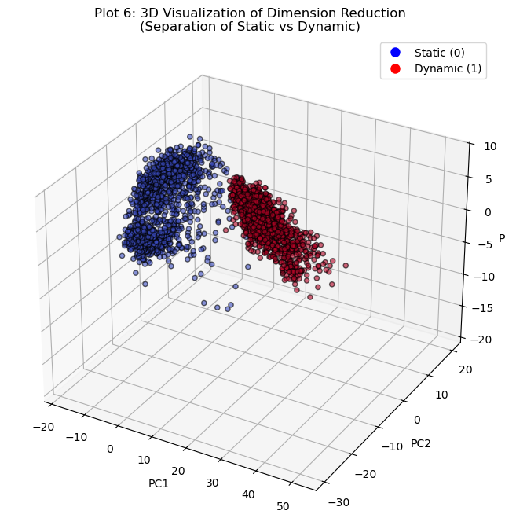
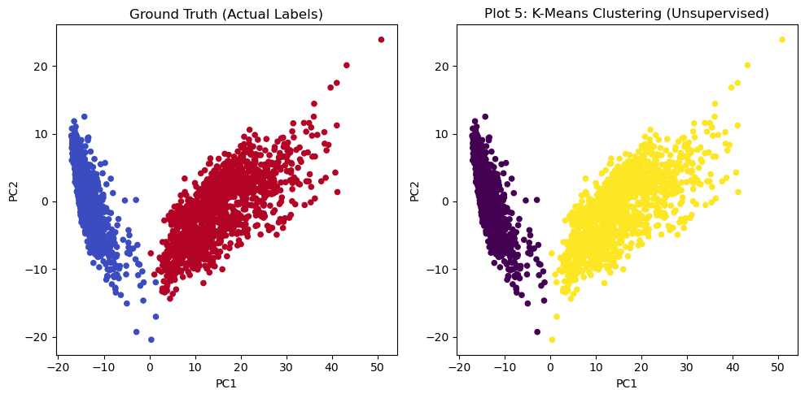
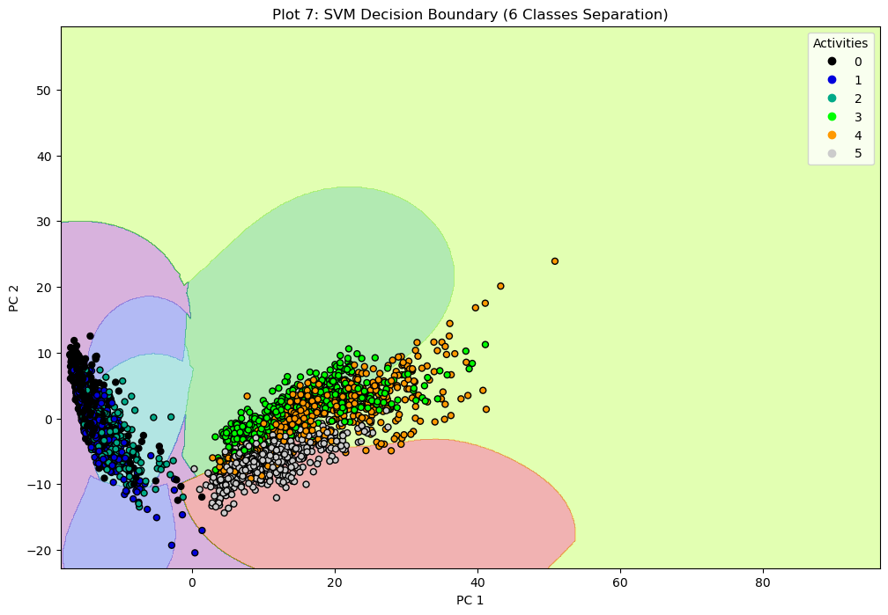
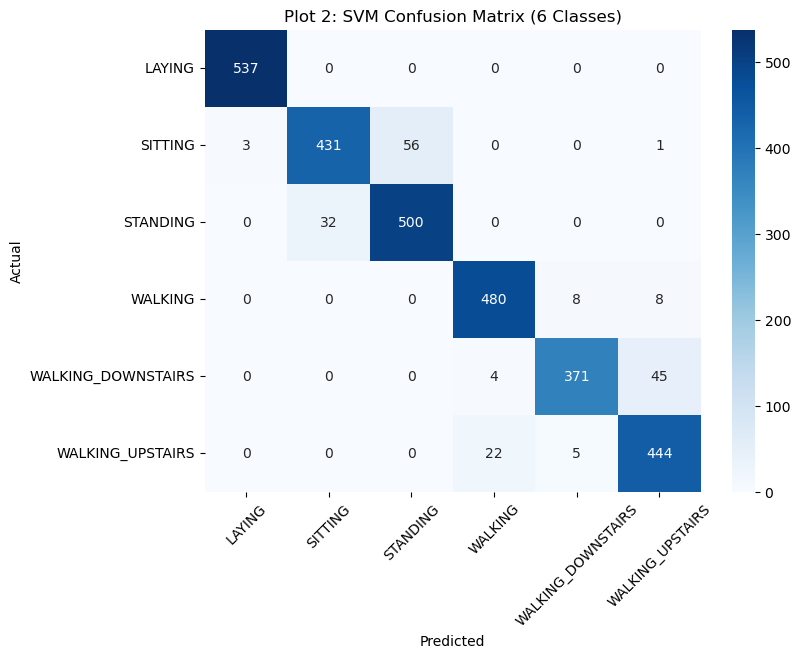
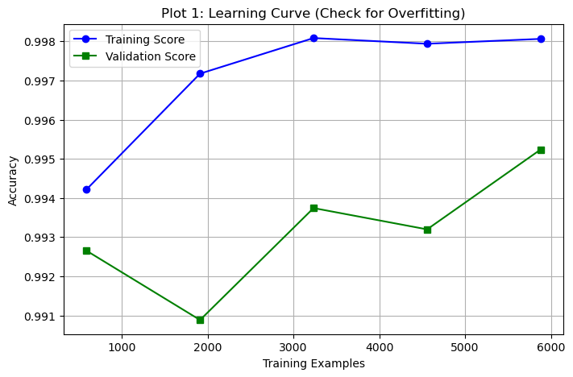
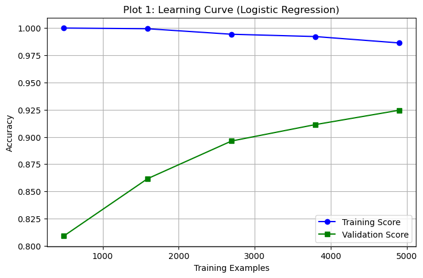
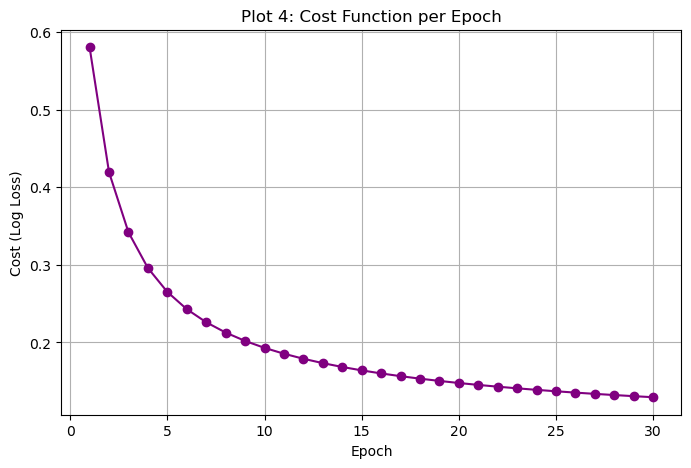

# Human Activity Recognition (HAR) using Smartphone Sensors

This repository contains the complete Machine Learning pipeline for predicting 6 human physical activities (Laying, Sitting, Standing, Walking, Walking Downstairs, Walking Upstairs) using 561 features extracted from mobile sensors (accelerometer and gyroscope). 

The project was executed in two phases at Kermanshah University of Technology:
1. **Phase 1:** Binary classification separating "Static" vs. "Dynamic" activities (Achieved **100% Accuracy**).
2. **Phase 2:** Multi-class classification separating all 6 distinct activities (Achieved **~94% to 96% Accuracy**).

---

## 📊 Dataset Specifications
- **Total Samples:** 10,299 (7,352 Training / 2,497 Testing)
- **Features:** 561 high-dimensional sensor components
- **Preprocessing:** Standardized using Z-Score ($Z = \frac{x - \mu}{\sigma}$) to scale features to zero mean and unit variance, effectively mitigating outlier noise.

---

## 🚀 Technical Pipeline & Mathematical Formulations

### 1. Dimensionality Reduction (PCA)
To tackle the curse of dimensionality and eliminate correlated features, **Principal Component Analysis (PCA)** was performed via Eigenvalue Decomposition of the covariance matrix:
$$\Sigma = \frac{1}{m}\sum_{i=1}^{m}(x^{(i)})(x^{(i)})^T$$

- Retained **95% of total variance**, compressing the feature space from **561 features down to 102 principal components**.
- Isolated static and dynamic domains clearly in a 3D feature space.

  
  

### 2. Supervised Classification Models

#### A. Support Vector Machine (SVM) with RBF Kernel
- Configured with a non-linear Radial Basis Function (RBF) kernel: $K(x, l) = \exp(-\gamma ||x - l||^2)$ and penalty parameter $C = 1.0$ to achieve optimal bias-variance trade-off.
- **Results:** Delivered top performance with **93.76% multi-class accuracy**. The core classification challenge was minor confusion between 'Sitting' and 'Standing' due to identical motionless accelerometer signals.

  

  
  

#### B. Multi-Class Logistic Regression (SGD)
- Implemented with the `lbfgs` solver and a Multinomial strategy, incorporating $L_2$ Regularization to prevent overfitting:
$$J(\theta) = -\frac{1}{m}\sum_{i=1}^{m} [y^{(i)}\log(h_\theta(x^{(i)})) + (1-y^{(i)})\log(1-h_\theta(x^{(i)}))] + \frac{\lambda}{2m}\sum_{j=1}^{n}\theta_j^2$$
- **Results:** Achieved a highly stable **93.15% accuracy** with smooth Log-Loss convergence.

  
  

---

## 📈 Model Comparison Summary

| Model | Multi-Class Accuracy | Cost Value | Generalization Status |
| :--- | :---: | :---: | :--- |
| **Support Vector Machine (SVM)** | **93.76%** | **0.1679** | **Good Fit** (Highly stable, robust on complex classes like stairs) |
| **Logistic Regression (SGD)** | ~93.15% | ~0.2124 | **Good Fit** (Excellent baseline, zero overfitting) |

---

## 🛠️ Environment & Tools
- **Language:** Python 3.x
- **ML & Math framework:** Scikit-Learn, NumPy, Pandas
- **Visualization:** Matplotlib, Seaborn